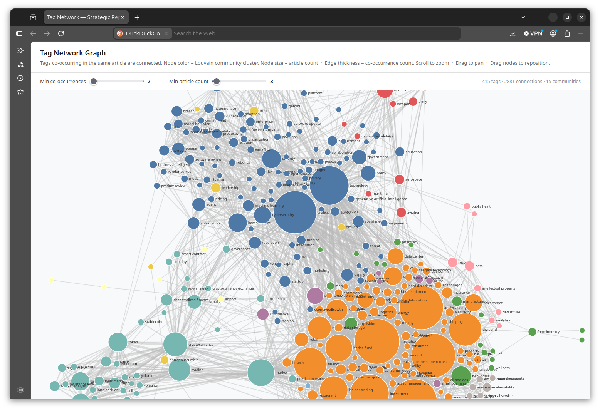

# Strategic Intelligence, Interconnected (Our Heroine Teaches Her Reporting Pipeline to Draw Its Own Knowledge Graph)

If you read our heroine's earlier dispatch, ["Daily Strategic Intelligence, Automated"](https://badassdatascience.substack.com/p/daily-strategic-intelligence-automated), you already know about the first pillar of her *Ultimate Cunning Master Plan™*: timely strategic insight. That post described a nightly AI workflow that reads a dozen topic areas' worth of RSS feeds, hands the results to an LLM, and then produces a tight strategic brief. That part of the plan works. It has worked for months. Nobody has complained, mostly because our heroine does not tell anyone it exists.

But a funny thing happens when you run the same pipeline every single night for sufficiently long enough: you stop having just a daily report, you begin compiling an *archive* of them. But an archive that just sits there, accumulating one HTML file per day, wastes potential. Somewhere in six months of nightly strategic bullets there exists a shape: some topics keep showing up together, some obscure tags from a one feed turn out to be quietly connected to tags from another feed, some stories from March rhyme with stories from July. You cannot see that shape by reading one HTML file at a time.

You need a graph.

Possibly several graphs.

This is the story of how our heroine built graphs that illuminate underlying themes, tags, and structures across the daily reports, and why these graphs matter.

## What is a Knowledge Graph?

(FILL THIS SECTION IN)

## Two Graphs, Not One

The first thing to get straight, because our heroine spent an embarrassing amount of time getting it straight in her own head first, is that this pipeline produces *two different graphs*, and they are not the same graph wearing different outfits. They answer different questions for different audiences, and one of our heroine's few hard rules on this project is that neither graph is permitted to pretend to be the other.

The first graph you can actually look at: a tag co-occurrence network, one node per tag, one edge per pair of tags that showed up in the same article, weighted by how often that happened (see the screenshot below for an example). It gets rebuilt fresh every single night from that night's articles alone, run through NetworkX to calculate its mathematical features, and then rendered as a self-contained, zero-dependency D3 force-directed graph that opens straight into your web browser. Node size is proportional to article count, edge thickness is proportional to co-occurrence strength, and color is derived from the calculated mathematical features (Louvain community detection, see below).

The second graph is where the story gets more interesting. The nightly D3 graph is useful for one thing and one thing only: looking at a single day's news expressed as a tag network. It is rebuilt from scratch with every pipeline run and therefore carries no memory of previous tag/topic interconnections.

But our heroine is no longer building a personal strategic intelligence resource — she's building the foundation of a multi-henchman supervillain empire. It follows that her daily strategic report archive must also communicate effectively with whatever other data archives she maintains (e.g., death-ray electricity consumption records, henchman performance review files, villainous business KPI metrics, etc.) A pile of nightly D3 displays, gorgeous as they are, simply cannot do that. What's needed is a durable, standard, portable export of everything the daily reports' tracking database has accumulated across every run. "Standard" turned out to be the operative word.

IN PROGRESS...
...
Faithful readers may recall our heroine's earlier flirtation with graph databases in ["The Data-Driven DJ"](https://badassdatascience.substack.com/p/the-data-driven-dj), where Neo4j and Cypher performed excellent work modeling harmonic transitions between DJ tracks. Property graphs like Neo4j's prove useful when the priority is developer ergonomics and built-in graph algorithms; Neo4j ships Louvain and PageRank as library calls. But Cypher itself only recently got an actual cross-vendor standard behind it (GQL, ratified in 2024), and the tooling ecosystem around it is still young. RDF, by contrast, has had a W3C-ratified data model, a W3C-ratified query language (SPARQL), and W3C-ratified ontology languages (RDFS, OWL) for the better part of two decades. If the goal is a knowledge base that outlives any one tool and can absorb other sources without everyone agreeing to buy the same database license, RDF is the more defensible bet — even though it means giving up Cypher's friendlier query syntax and those free built-in algorithms. Our heroine kept the free algorithms anyway, incidentally: Louvain still runs in NetworkX for the nightly D3 graph. She just isn't asking the RDF side to do double duty as her graph-analytics engine.

## Louvain Community Detection, or: Letting the Graph Tell You Its Own Story

Our heroine could have labeled each cluster in the tag graph by hand — "this blob is mostly AI stuff, that blob is mostly geopolitics" — but that's the kind of lazy, top-down labeling that assumes the news respects the topic categories she made up months ago in a Slack message to herself. It usually doesn't. So instead, every run, after the co-occurrence graph is built, it gets handed to the Louvain community detection algorithm — a modularity-maximizing method that partitions a graph into densely-interconnected clusters without being told in advance how many clusters there should be or what to call them. The graph decides its own community structure. Our heroine just watches, and then names each community after whichever tag inside it has the highest count, purely for the tooltip's benefit.

This produces something genuinely more interesting than a topic label: cross-cutting clusters that ignore the RSS feed boundaries entirely. A community might turn out to be ninety percent "biotech" articles and ten percent "defense" articles that all happen to be about the same export-control fight, and Louvain will cheerfully lump them together because the *tags* say they belong together, even though the feed categories say otherwise. That is precisely the kind of thing a human skimming twelve separate topic pages would never notice, and precisely the kind of thing our heroine's Ultimate Cunning Master Plan™ was built to surface.

Community detection also earns its keep in a second way: once every article's tags are grouped by community, the pipeline makes one additional LLM call per community, grounded strictly in that community's own articles, to write an actual paragraph describing what the cluster of coverage is substantively about — not "the AI community," but a real sentence about what's actually happening in it. Labeled-by-top-tag was a crutch. Labeled-by-substance is the whole point.

## Bridge Tags: A Structural Signal the LLM Doesn't Get to Make Up

Somewhere in the tag graph there are tags that show up across three, four, five different topic areas in the same night — not "AI" showing up in the AI feed, but something like "export controls" showing up in AI, defense, *and* economics coverage on the same day. Our heroine calls these bridge tags, and finding them requires no LLM at all: it's a pure graph-structural computation over the tag-to-topic membership already sitting in the co-occurrence graph, sorted by how many topics each tag spans.

Bridge tags then get handed, as a short list, into the prompt for the one LLM call per night that's allowed to talk across topic boundaries: the cross-topic strategic synthesis. Critically, they're handed over as *candidate leads the model must confirm*, not facts the model gets to invent — the system prompt is explicit that a bridge tag is a structural hint, not a foregone conclusion, and the model has to actually demonstrate the cross-domain connection is real rather than just repeating the tag back. This is our heroine's small, stubborn insistence that cross-topic insight should be grounded in something a computer can point to, not purely in whatever plausible-sounding pattern an LLM feels like inventing at 2am.

## Ask Me Anything (About the Archive, Grounded, Please)

All of this — the nightly co-occurrence graph, the Louvain communities, the community summaries — gets persisted to a SQLite tracking database, linked by a run ID, which is what turns "tonight's report" into "the whole archive." And an archive you can't query is just a very organized junk drawer, so the pipeline has a graph-guided retrieval command: ask it a free-text question, and it extracts a handful of candidate tags from your question via an LLM call, matches those tags against every community summary ever written (exact tag membership first, a text-substring fallback second), and synthesizes an answer grounded strictly in whatever community summaries actually got retrieved.

Our heroine wants to be very clear, mostly to herself, that this is *not* full GraphRAG. There are no embeddings. There is no hierarchical multi-level community summarization. It is a deliberately scoped-down retrieval strategy for a single-user archive, not a first draft of something grander — a distinction that matters because it's tempting to look at "graph-guided retrieval" and assume it's secretly GraphRAG wearing a trench coat. It isn't. It's simpler, cheaper, and grounded only in what the graph structure actually retrieved, which is exactly the point.

## Enter RDF: The Second Graph, and Why It Had to Be Different

#######Here is where the story bends. The nightly D3 graph is wonderful for one thing and one thing only: looking at tonight's news, once, in a browser, by yourself. It is rebuilt from scratch every run and it has no memory of last week. But our heroine is not building a strategic intelligence hobby anymore — she's building the foundation of a multi-employee strategic consulting practice, and *that* archive needs to talk to other archives eventually: client documents, meeting notes, whatever else eventually joins the knowledge base. A pile of nightly D3.js files, gorgeous as they are, cannot do that. What's needed is a durable, standard, portable export of everything the tracking database has accumulated across every run — and "standard" turned out to be the operative word.

#####Faithful readers may recall our heroine's earlier flirtation with graph databases in ["The Data-Driven DJ"](https://badassdatascience.substack.com/p/the-data-driven-dj), where Neo4j and Cypher did excellent work modeling harmonic transitions between DJ tracks. Property graphs like Neo4j's are wonderful when the priority is developer ergonomics and built-in graph algorithms — Neo4j ships Louvain and PageRank as library calls, which is not nothing. But Cypher itself only recently got an actual cross-vendor standard behind it (GQL, ratified in 2024), and the tooling ecosystem around it is still young. RDF, by contrast, has had a W3C-ratified data model, a W3C-ratified query language (SPARQL), and W3C-ratified ontology languages (RDFS, OWL) for the better part of two decades. If the goal is a knowledge base that outlives any one tool and can absorb other sources without everyone agreeing to buy the same database license, RDF is the more defensible bet — even though it means giving up Cypher's friendlier query syntax and those free built-in algorithms. Our heroine kept the free algorithms anyway, incidentally: Louvain still runs in NetworkX for the nightly D3 graph. She just isn't asking the RDF side to do double duty as her graph-analytics engine.

## Building the Ontology Without Reinventing One

The whole point of choosing RDF was to stop reinventing standards, so the actual schema design leans hard on vocabularies that already exist rather than inventing a bespoke one from scratch:

- **SKOS** gives every tag a home as a `skos:Concept`, which turns out to be almost embarrassingly easy since the tag normalizer already collapses spelling variants and synonyms into a canonical form before anything reaches the database — SKOS just gives that existing cleanup formal RDF shape. Louvain communities map onto `skos:Collection`, with each community's member tags linked via `skos:member`, which is a nicer fit than our heroine expected going in.
- **PROV-O** tracks provenance: every run becomes a `prov:Activity`, and every fact derived from that run — an article, a bullet, a community summary, the cross-topic overview — links back to it via `prov:wasGeneratedBy`. This is really just the `run_id` foreign key that's threaded through every table in the tracking database already, given a standard vocabulary instead of a bespoke column name.
- **schema.org** covers article bibliographic fields — headline, URL, publish date — because there was no reason to invent a worse version of `schema:Article` when a perfectly good one already exists, and it's popular enough that search engines and scrapers already know how to read it. (It's popular enough, in fact, that the nightly per-article HTML pages now carry the same `schema:Article` JSON-LD markup directly, for anyone who only has the HTML and never touches the database at all.)
- A small custom namespace, `stratrep:`, covers exactly the handful of things that are genuinely domain-specific and have no clean standard equivalent: topics, urgency scores, bridge-tag observations, and the cross-topic overview. It stays small on purpose. Every time our heroine was tempted to add a new custom term, the first question was "does schema.org, SKOS, or PROV-O already have a home for this," and more often than not, one of them did.

The export itself is a separate, on-demand command that reads the tracking database and rebuilds the full Turtle file from scratch — every run, from every article, tag, community summary, bridge tag, strategic bullet, urgency score, and cross-topic overview ever recorded. Deliberately not incremental by default: a full rebuild is simple and always correct, and correctness beats cleverness until the database is large enough to actually need cleverness, which it is not yet.

## Complementary, Not Competing

To say it one more time, because our heroine really did have to say it to herself several times during development: the RDF export does not replace the nightly D3 graph, and the nightly D3 graph does not get consulted when building the RDF export. They read from different places (this run's in-memory results versus the database's entire history), they serve different audiences (a human glancing at tonight's news versus a machine integrating years of archive into a bigger knowledge base), and they are not allowed to depend on each other. Keeping that boundary bright-line clear was, frankly, more work than writing the ontology mapping.

## Putting It on a Schedule (Its Own Schedule, in Its Own Corner)

The nightly report pipeline runs on its own Prefect-managed schedule, 00:30 Pacific, exactly as described in the original dispatch. The RDF export now runs on its *own* separate schedule too — 04:00 Pacific, comfortably after the report has finished writing to the database — as its own independent process with its own systemd unit, not a task bolted onto the main pipeline. If the report pipeline ever crashes at 1am, the RDF exporter doesn't even notice. If the RDF exporter ever needs restarting, the strategic report keeps landing in inboxes on schedule regardless. Independence, it turns out, is worth the extra systemd file.

## What's Deliberately Not Here Yet

In the spirit of previous dispatches admitting what the Ultimate Cunning Master Plan™ does *not* yet do: there is no tag hierarchy in the SKOS layer (`skos:broader`/`skos:narrower` are supported by the standard and simply unused so far — nothing stops adding real hierarchy later without restructuring anything already built), there are no embeddings anywhere in the retrieval story, and the RDF export's `--since` flag filters which runs get included in a given export but does not merge into an existing file — every invocation is a fresh, complete rebuild, and stitching multiple exports together is left to whatever eventually loads them into a real triple store. All deliberate v1 scope choices, not oversights, and all candidates for a future dispatch once the multi-source knowledge base actually needs them.

---

**AI use statement:** Our heroine designed the graph architecture, the ontology mapping, and the process-independence decisions herself, then directed Claude Code to implement, test, and document all of it in the actual codebase across several sessions of back-and-forth review. Having gotten that far, she decided to ask Claude to draft this companion article in the same voice as the original, which she then edited by hand before letting it anywhere near the internet.
